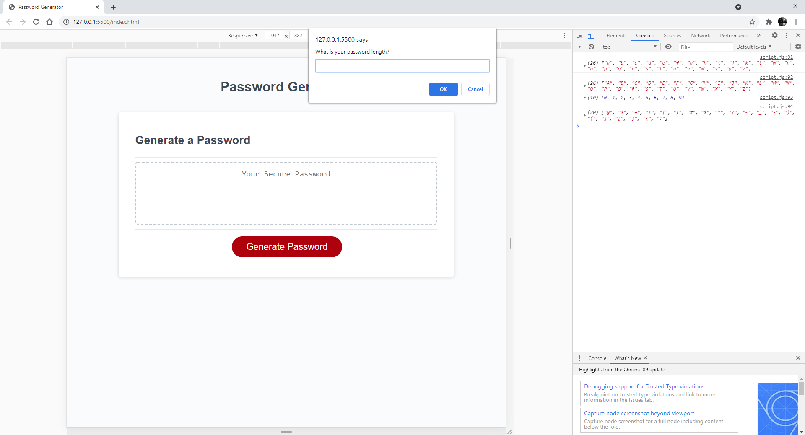
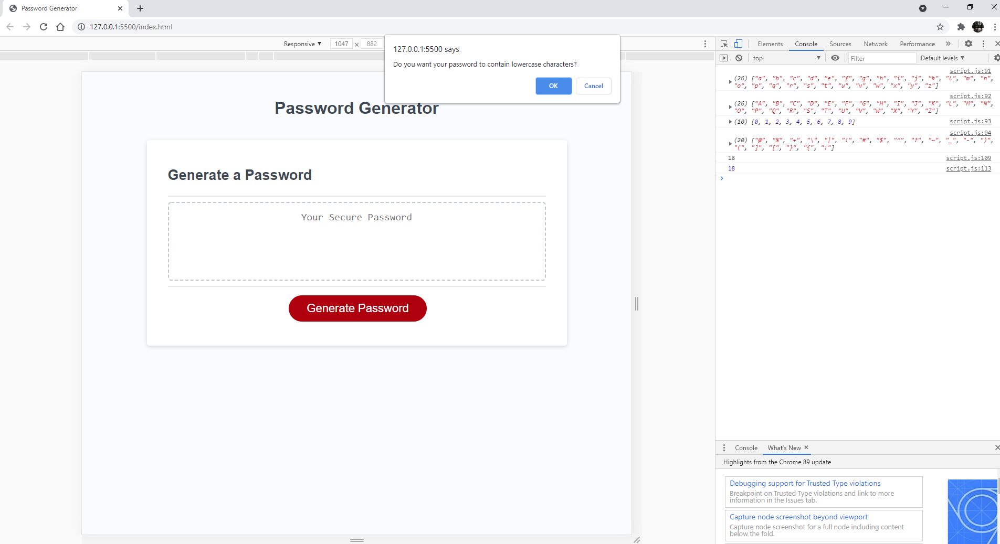
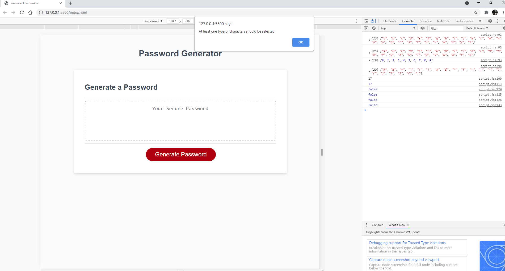
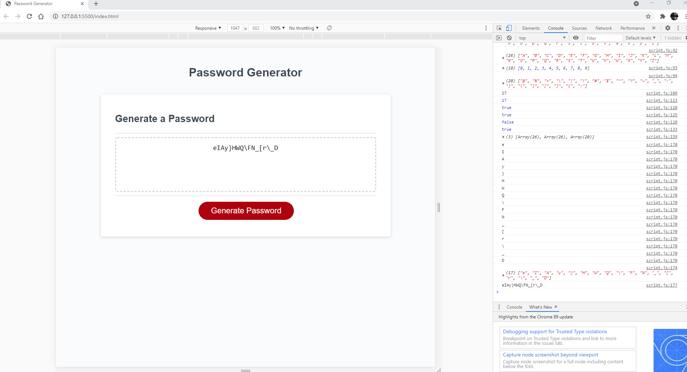
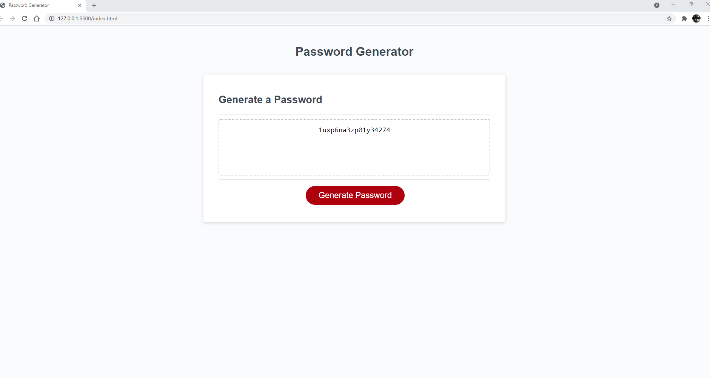

# Password Generator

## Project Link

Click [here](https://iwanagahime.github.io/Password-Generator/.) to view project on GitHub pages.

## Description

We were asked to modify starter code to create an application that enables employees to generate random passwords based on criteria that they’ve selected. This app runs in the browser and features dynamically updated HTML and CSS powered by JavaScript code that we wrote. It has a clean and polished, responsive user interface that adapts to multiple screen sizes.

## What did we do?

- Declare
-
-
-
-
-
- Format code using prettier

## Getting started

- Clone the GitHub project onto your local machine
- Navigate into the project
- Open the project in VSCode
- Open the `script.js` file in your default browser

```
git clone https://iwanagahime.github.io/Password-Generator/.
code .
```

## Screenshots

### Prompt



### Confirm



### Alert




### Generated password



